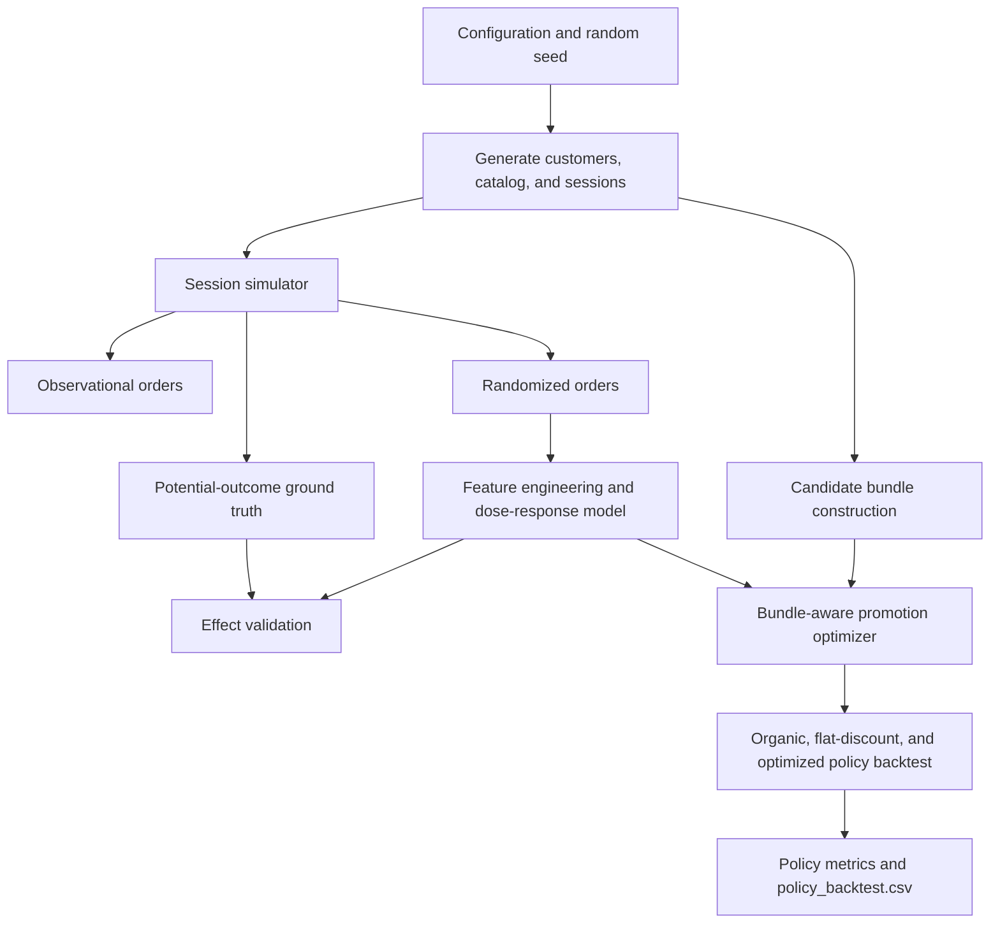

# Food Delivery Causal Policy Simulation

## What It Does
This project builds a reproducible synthetic food-delivery marketplace, including customers, restaurants, menu items, bundles, session context, observational treatment assignments, randomized assignments, and simulated treatment-effect ground truth. It trains a dose-response model using randomized outcomes, validates predicted heterogeneous effects against the simulator's ground truth, and compares organic, flat-discount, and bundle-aware promotion policies in a simulated backtest.

## Why It Matters
Food-delivery promotions can raise conversion and order value while reducing contribution margin through discount expense, fulfillment costs, and offers given to customers who would have ordered anyway. The project demonstrates a decision-science workflow for measuring incremental impact and targeting incentives selectively, rather than judging promotions by revenue or conversion alone. The dataset and findings are synthetic; this is a research prototype, not evidence that a production promotion strategy will produce the same lift.

## How It Works


The notebook runs the calibrated pipeline with a 25% organic-conversion baseline and saves CSV datasets and `policy_backtest.csv` under `Data/calibrated_25pct`. Its main validation run uses 1,000 customers and 1,000 backtest sessions; a separate five-seed robustness check uses smaller 250-customer configurations. The original 5,000-customer defaults remain in the simulation configuration but were not used for the calibrated results summarized below.

## Results
### Calibrated Backtest
The latest saved run uses 1,000 customers, 7,436 generated sessions, a 1,000-session backtest, and a 25% organic-conversion baseline. The realized organic conversion rate was 23.1%. The bundle-aware policy had the highest simulated margin while spending less on promotions than flat 10%.

| Policy (1,000 backtest sessions) | Gross revenue | Net margin | Promotion cost | Conversion | Mean discount | Incremental margin vs. organic |
|---|---:|---:|---:|---:|---:|---:|
| Organic | ₹160,159.14 | ₹40,954.42 | ₹0.00 | 23.1% | 0.0% | ₹0.00 |
| Flat 10% discount | ₹659,475.24 | ₹108,852.33 | ₹65,947.63 | 85.4% | 10.0% | ₹67,897.91 |
| Bundle-aware | ₹584,762.70 | ₹125,145.04 | ₹29,393.01 | 62.4% | 5.0% | ₹84,190.62 |

Mean margin per session was ₹40.95 for organic (95% bootstrap interval ₹36.02–₹45.91), ₹108.85 for flat 10% (₹105.22–₹111.92), and ₹125.15 for bundle-aware (₹118.80–₹131.41). These intervals reflect session resampling within this simulation only.

### Uplift and Diagnostics
On the held-out randomized sample, the dose model's CATE RMSE was ₹11.46 and correlation with simulator ground truth was 0.862. For margin, Qini AUUC was 6,478 versus a random-ranking mean of 3,327; top-10% uplift was ₹47.82 versus ₹9.25 for random. Revenue AUUC was 127,444 versus 108,394 for random. These are synthetic-data diagnostics, not production causal estimates.

Observed promotion cannibalization was 23.1% for bundle-aware and 24.1% for flat 10%. The bundle-aware policy used 18 bundles, with a 68.6% top-bundle share; flat and organic each used 9 bundles with 20.4% top-bundle share. The 300-session model-based 25% bundle-cap check raised unique bundles from 12 to 22 and reduced predicted incremental margin from ₹49.02 to ₹43.67 per session. This is a predicted allocation trade-off, not a constrained backtest.

The expected-margin decomposition ranked better than the direct dose model and binary T-learner on the common-dose holdout (CATE correlations 0.826, 0.701, and 0.689, respectively); the oracle top-decile true effect was ₹56.71. Five-fold CATE correlation averaged 0.600 (SD 0.074). Across five smaller 250-customer seed runs, mean CATE correlation was 0.716 (SD 0.053), bundle-aware margin lift was ₹44.99 per session (SD ₹21.93), and cannibalization was 23.2% (SD 3.5 percentage points).

The earlier 5,000-session results are superseded by this calibrated run. All reported outcomes remain synthetic and depend on simulator assumptions.

## Limitations
- All customer behavior, assignments, outcomes, costs, and ground truth are simulated from assumptions in the notebook. Results do not establish real-world treatment effects or business impact.
- The dose-response model is validated against synthetic ground truth from the same simulator family. Its error and correlation should not be interpreted as a production model benchmark.
- The policy backtest evaluates decisions inside that simulator; it is not a randomized deployment or an off-policy evaluation on real marketplace logs.
- Defaults and outcomes depend on the random seed, cost assumptions, and candidate-bundle rules. Re-run with alternative assumptions and seeds before drawing broader conclusions.
- The primary calibrated results use one 1,000-customer seed. The five-seed check is smaller (250 customers per seed), so it is a robustness diagnostic rather than confirmation at the primary run's scale. Bootstrap intervals quantify only session-level resampling variability within the simulated backtest.

## How to Run
Use Python 3.10 or newer. From the project directory in Windows PowerShell:

```powershell
py -m venv .venv
.\.venv\Scripts\Activate.ps1
python -m pip install --upgrade pip
python -m pip install numpy pandas scikit-learn lightgbm jupyter
jupyter lab FDP_new.ipynb
```

In JupyterLab, select the `.venv` kernel and run all cells from top to bottom. In VS Code, open `FDP_new.ipynb`, select the same virtual-environment kernel, and choose **Run All** from the project directory. The calibrated CSV outputs are written to `Data/calibrated_25pct`.

The notebook prints the observational/RCT/ground-truth comparison, dose-response validation metrics, policy summary, and robustness diagnostics. The calibrated output folder contains `customers.csv`, `restaurants.csv`, `items.csv`, `bundles.csv`, `sessions.csv`, `orders_observational.csv`, `orders_randomized.csv`, `ground_truth_effects.csv`, and `policy_backtest.csv`.
